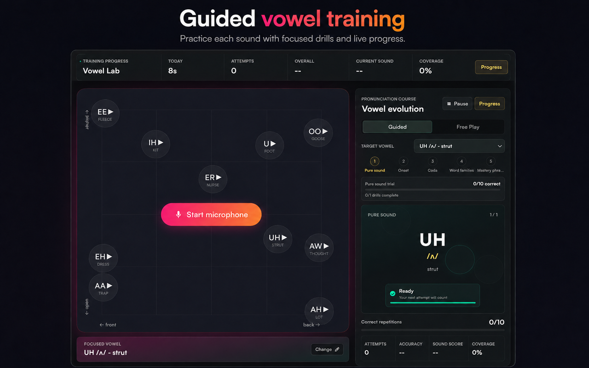
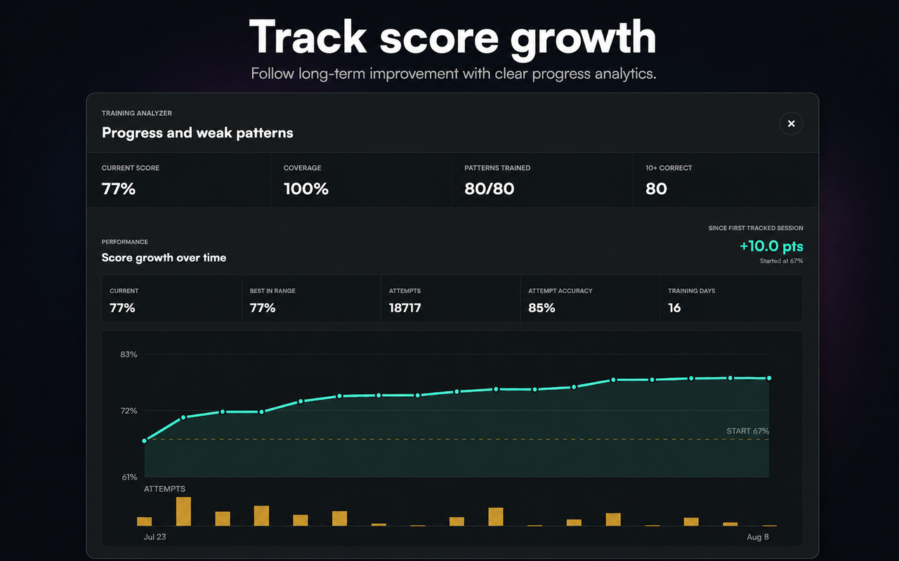
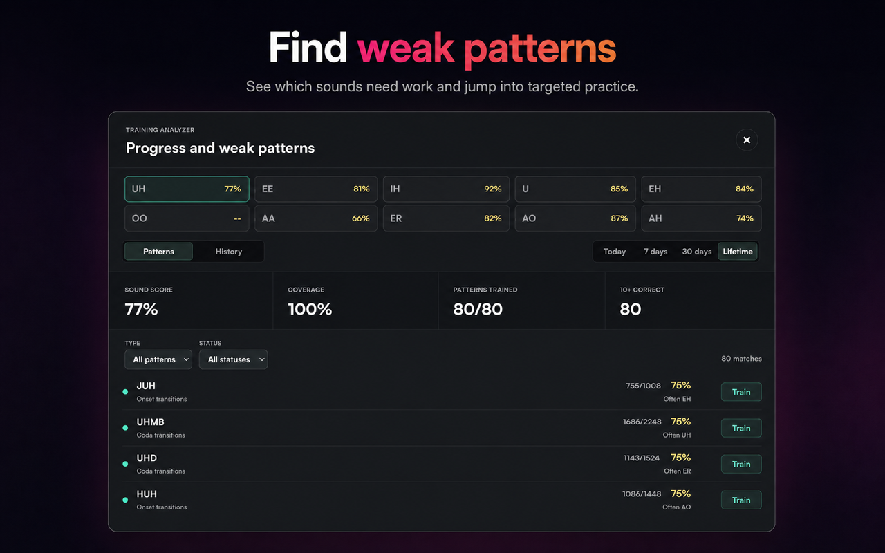

# BoldVoice Vowel Progress Coach

An unofficial Chrome extension for practicing pronunciation on the [BoldVoice Vowel Map](https://boldvoice.com/games/vowel-map).

The extension turns the live vowel map into a guided training tool. It shows the current target, gives live visual feedback, and saves training progress locally in Chrome.

## Screenshots And Video

### Guided Training

### Progress History

### Weak Pattern Training

### Demo Video

https://github.com/user-attachments/assets/784d0ede-161a-449f-a5bb-c3ddc26972f3

## How It Works

1. Open the BoldVoice Vowel Map.
2. Choose a sound and open Guided Training.
3. Say the prompt while watching the live vowel movement.
4. The extension checks whether the target vowel was reached.
5. Correct and incorrect attempts update the current pattern and progress history.

The extension reads the vowel state from the current BoldVoice page. It does not record or upload microphone audio, and training data stays in the browser.

## Training Progression

Each sound moves from simple practice to more difficult speech:

1. **Pure sound** - practice the vowel by itself.
2. **Onset transitions** - add sounds before the vowel.
3. **Coda transitions** - add sounds after the vowel.
4. **Word families** - practice real and drill word forms built from the sound patterns.
5. **Mastery phrases** - use results from earlier stages to practice longer phrases and improve the sound level.

Each item needs ten correct repetitions. Mistakes remain in the statistics, so accuracy shows how reliable the pattern is. After the word-family stage, mastery levels advance in five-point steps toward 95%. Completed items are skipped while weaker items continue to return.

## What Is Tracked

The extension keeps local progress for:

- Correct and total attempts for each pattern.
- Accuracy and curriculum coverage.
- Current sound, stage, word family, pattern, and repetition.
- Skips, daily activity, and progress history.

This makes it possible to return later and continue from the same place, or open a specific weak pattern for targeted practice.

## Modes

- **Guided Training** follows the curriculum in order.
- **Targeted Training** opens a selected sound, transition, word, or phrase.
- **Free Play** provides an extra pronunciation game outside the curriculum.

The prompt card includes a small live vowel-map view, a target highlight, and a ready/reloading state so it is clear when the next attempt can count.

## Project Notes

- Supported page: `https://boldvoice.com/games/vowel-map*`
- The extension uses Manifest V3.
- Training data is bundled with the extension.
- Progress is stored with Chrome local extension storage.

Publishing and privacy details are kept separately:

- [Chrome Web Store submission notes](docs/CHROME_WEB_STORE_SUBMISSION.md)
- [Privacy policy](docs/PRIVACY_POLICY.md)
